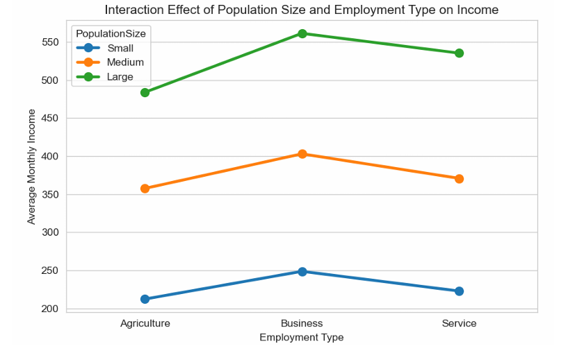
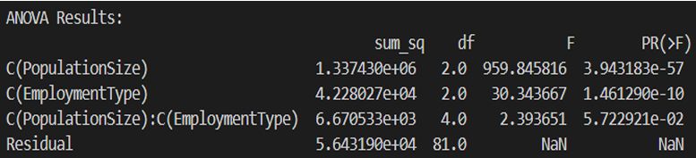
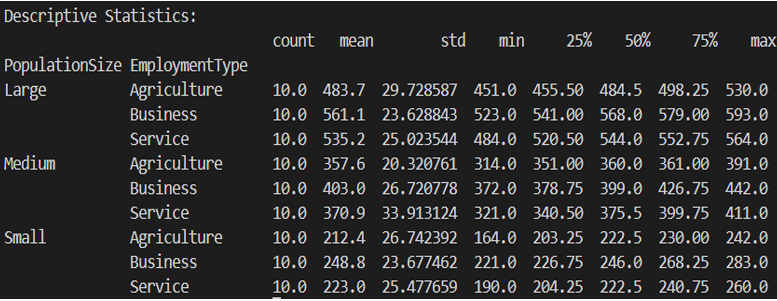
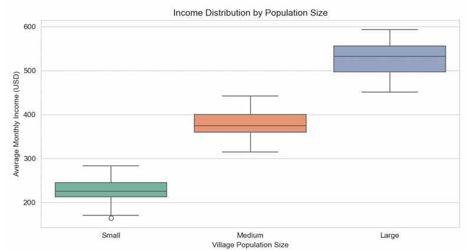
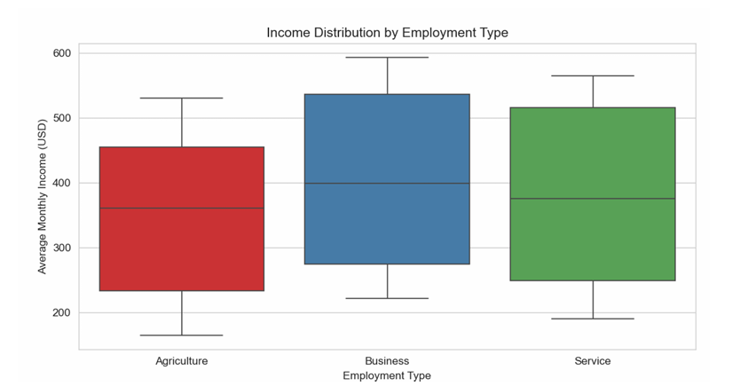

## 🧮 Analysis of Income Levels in Villages Based on Population Size and Employment Type Using Two-Way ANOVA

## 📘 Introduction

This study applies a **Two-Way ANOVA** to examine how **village population size** and **employment type** impact the **average monthly income per household**. Understanding these relationships is essential for policymakers aiming to improve economic well-being in rural areas.

## 📊 Variables Considered

### 🎯 Dependent Variable:

* **Average Monthly Income per Household**

### 🧩 Independent Variables (Factors):

1. **Village Population Size**

   * Small (Population < 1000)
   * Medium (Population 1000–5000)
   * Large (Population > 5000)

2. **Employment Type**

   * Agriculture
   * Business
   * Service

This analysis tests both the **main effects** and the **interaction effect** of the two factors.

## 🧪 Hypothesis Formulation

### 🔹 Main Effects

* **H₀₁**: Population size does **not** significantly impact income.

* **H₁₁**: Population size **significantly** impacts income.

* **H₀₂**: Employment type does **not** significantly impact income.

* **H₁₂**: Employment type **significantly** impacts income.

### 🔸 Interaction Effect

* **H₀₃**: No interaction effect between population size and employment type.
* **H₁₃**: There **is** an interaction effect between population size and employment type.
  

## 🧾 Dataset

A **hypothetical dataset** was generated with **90 random data points**, with **10 records per combination** of population size and employment type. Income values reflect realistic trends:

* Lower incomes in small villages
* Higher incomes in Business and Service sectors

## 📋 Results and Interpretations

### 🔬 ANOVA Table Summary:

| Source                  | Sum of Squares | df | F-value | p-value      | Significance      |
| ----------------------- | -------------- | -- | ------- | ------------ | ----------------- |
| Population Size         | 1,337,430      | 2  | 959.85  | 3.94 × 10⁻⁵⁷ | ✅ Significant     |
| Employment Type         | 42,280         | 2  | 30.34   | 1.46 × 10⁻¹⁰ | ✅ Significant     |
| Interaction (Pop × Emp) | 6,670          | 4  | 2.39    | 0.057        | ❌ Not Significant |

### 🧠 Key Findings

1. ✅ **Population size** has a significant impact on income (p < 0.0001).
2. ✅ **Employment type** significantly influences income (p < 0.0001).
3. ❌ **No significant interaction effect** (p = 0.057): Employment type impacts income similarly across village sizes.

   

## 📈 Descriptive Statistics

| Population Size | Employment Type | Mean Income | Standard Deviation |
| --------------- | --------------- | ----------- | ------------------ |
| Small           | Agriculture     | \$212       | \$26.74            |
| Small           | Business        | \$248       | \$23.67            |
| Small           | Service         | \$223       | \$25.47            |
| Medium          | Agriculture     | \$357       | \$20.32            |
| Medium          | Business        | \$403       | \$26.72            |
| Medium          | Service         | \$370       | \$33.91            |
| Large           | Agriculture     | \$483       | \$29.72            |
| Large           | Business        | \$561       | \$23.62            |
| Large           | Service         | \$535       | \$25.02            |

### 🔍 Observations

* Business and Service jobs yield **higher incomes** than Agriculture.
* **Income increases** as village population size increases.

  

## 🖼️ Visual Analysis

### 1. 📊 Income Distribution by Population Size

> Larger villages show **higher median incomes**; small villages have **less variation** and **lower overall income**.

 

### 2. 💼 Income Distribution by Employment Type

> **Business jobs** provide the **highest income**, followed by **Service**, and **Agriculture** being the lowest.

 

## 📌 Conclusion

1. **Larger villages** have **higher average incomes**, likely due to better infrastructure and opportunities.
2. **Agriculture** provides the **lowest income**, while **Business** and **Service** jobs improve earnings.
3. Employment type impacts income **consistently across village sizes**.

## 📢 Policy Recommendations

* Promote **non-agricultural jobs** in smaller villages (e.g., Business, Service sectors).
* Invest in **infrastructure development** in small villages to attract businesses and improve economic outcomes.

